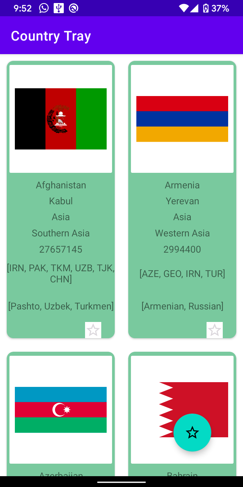
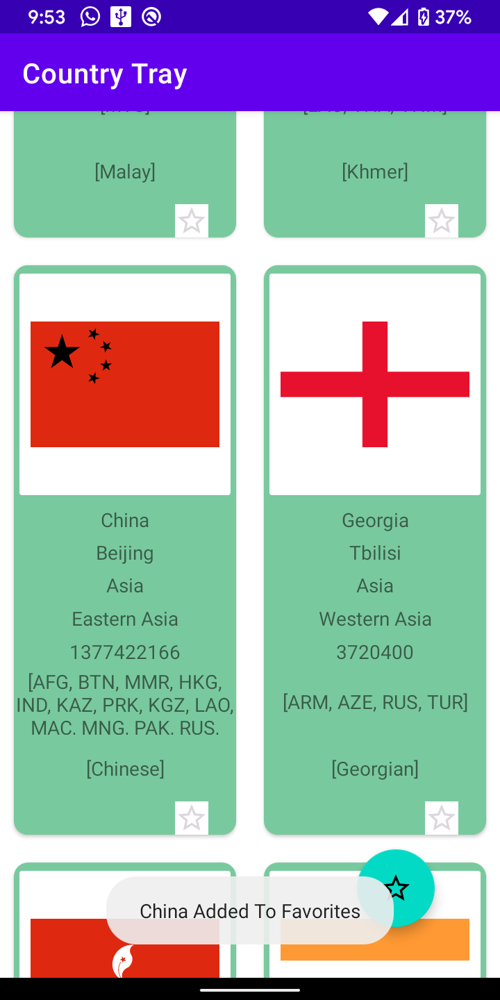
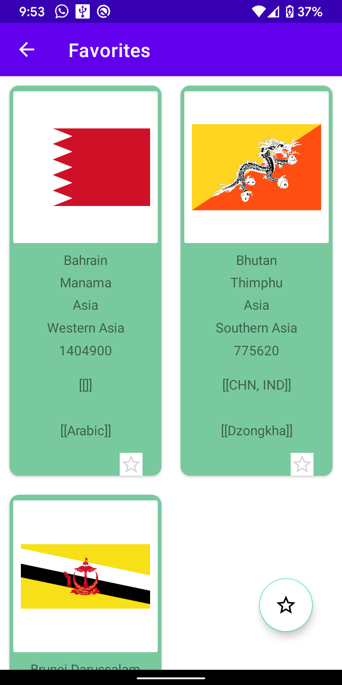

## Summary: rest api used https://restcountries.eu/
RoomDatabase= Database  
Picasso ,Pixplicity/sharp and Okhttp3 = Viewing The SVG image in imageview
# Main Page (Grid List View Fetching Data Online)

# Saving To RoomDB (Saving Data Shown By Toast)

# Favorites Page (Offline Viewing)

Apk Link : https://github.com/harshitsrivastava1608/MiskaaIntern/blob/b_one/app-debug.apk
